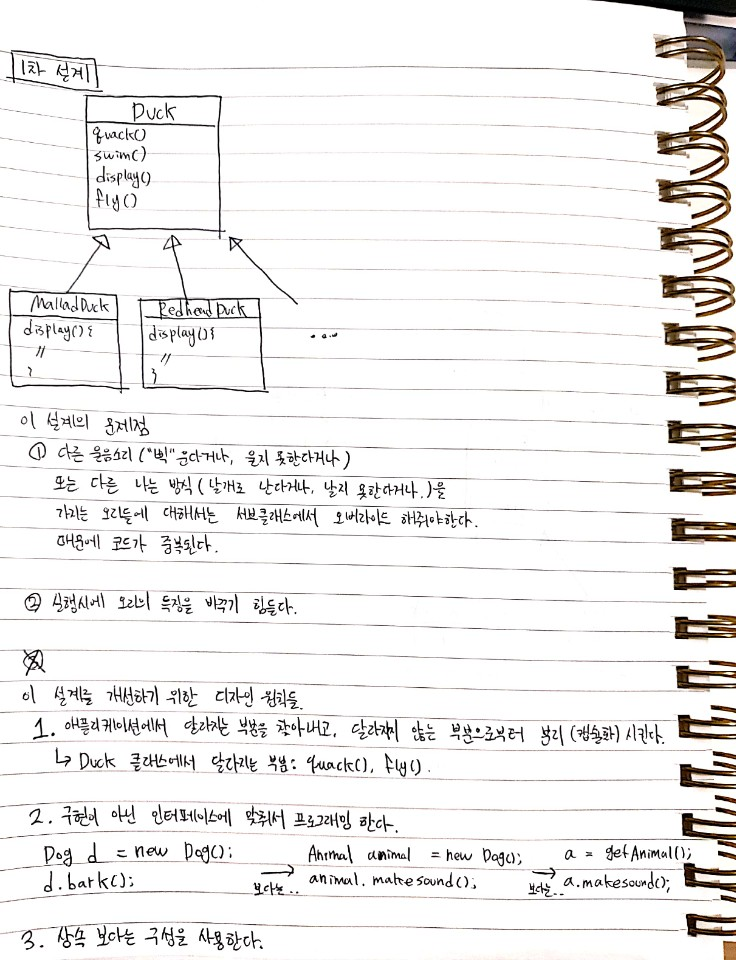
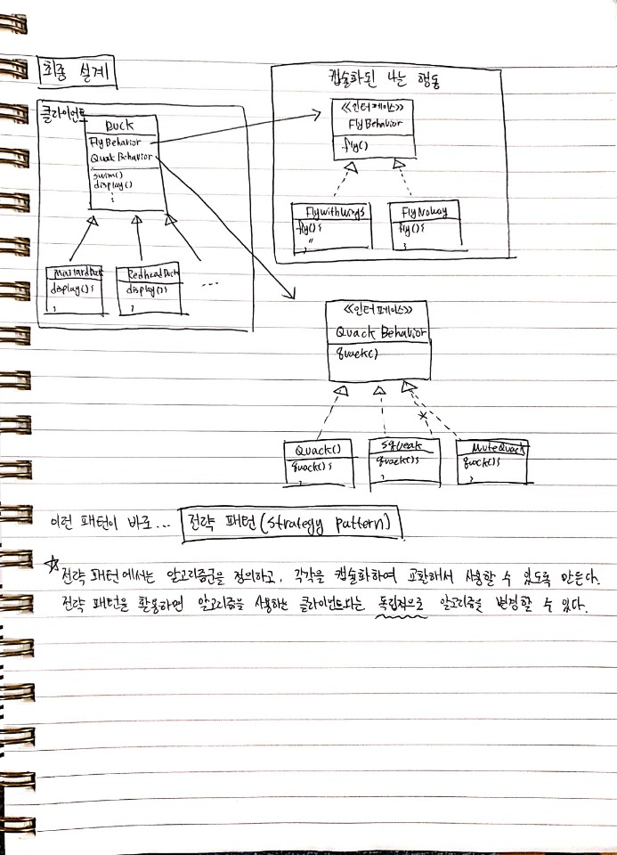

# 1. Strategy Pattern (전략 패턴)

## 필기

## 확인 문제들

1. Joe가 처음 만든 설계도를 그리고, 그 설계의 문제점을 말해주세요.
2. Joe의 설계를 개선 시킬 디자인 원칙 1을 설명해주세요.
3. 디자인 원칙 2를 설명해주세요.
4. 디자인 원칙 3을 설명해주세요.
5. 전략 패턴이란 무엇인지 설명해주세요.
6. 전략 패턴을 이용해 최종적으로 만든 설계도를 그려주세요.
7. 해당 설계를 자신 있는 언어로 직접 구현해주세요.